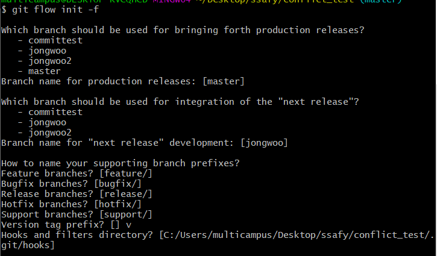
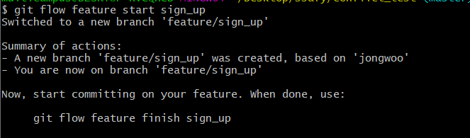
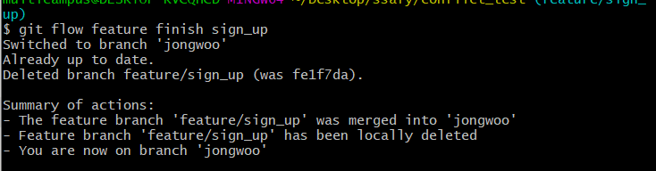
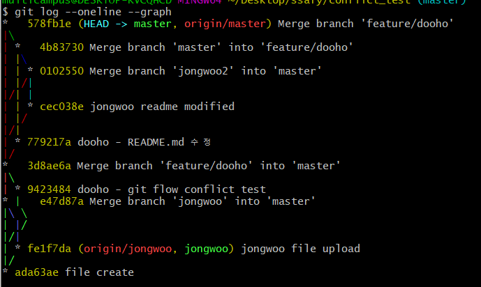

# Git flow

> 효과적으로 git 브랜치 전략을 활용하기 위한 방안


Vincent Driessen이 제안한

#### `브랜칭 모델`

- **master** : 제품으로 출시될 수 있는 브랜치
- **develop** : 다음 출시 버전을 개발하는 브랜치
- **feature** : 기능을 개발하는 개발자
- **hotfix** : 출시 버전에서 발생한 버그를 수정하는 브랜치
- **release** : 이번 출시 버전을 준비하는 브랜치

<br>

## 실습

> git conflict 테스트용으로 만든 디렉토리의 git flow 확인

git flow 생성

```bash
git flow init
```



sign_up이라는 브랜치가 생성되면서 자동 스위치 (브랜치가 feature/sign_up으로 변경)

```bash
git flow feature start sign_up
```



개발이 끝난 후 finish 사용 => 자동 merge

```bash
git flow feature finish sign_up
```



git flow 확인

```bash
git flow --oneline --graph
```

