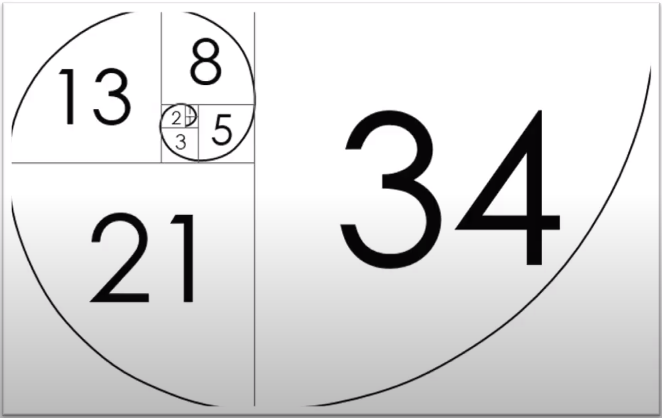

# JIRA

 

## JIRA를 왜 쓰는가?

> 프로젝트 관리
>
> 협업
>
> 트러블슈팅

새로운 업무가 생겼을 때 자세한 업무 내용을 사람들에게 물어보거나 하는 불필요한 시간 낭비를 줄일 수 있음

업무를 어떻게 수행했는지 한 눈에 알 수 있음

 

## 기능

#### `Active sprint`

>  작업을 To do - In Progress - Done 으로 나눠 관리하는 board

 

#### `Workflow`

> 위에서 작성한 업무 리스트를 순서도 형식으로 정리
>
> `To do` : 이슈등록
>
> `In progress` : 작업중
>
> `Done` : 작업 완료

- **burndown chart (중요!!)** : 매일 정해진 시간에 policy 업데이트. JIRA의 대표적인 output

  

 

#### `Story point`

> 작업 난이도 : 능력 편차가 심한 회사 직원들에게 각자의 능력에 맞는 난이도의 업무 하달
>
> SSAFY는 `man-month`로 사용
>
> 다른 회사 대부분도 man-month로 사용

 

 

## JIRA를 어떻게 어필할까

> 포트폴리오에 활용 가능
>
> - 꾸준히 작업, 일정 관리, 문서화 정리 등을 잘 했는지 
>
> Scrum, Kan-ban 둘 다 괜찮다
>
> **이슈 등록은 다 같이! 완료 처리는 등급에 따라 권한 부여!**
>
> 

